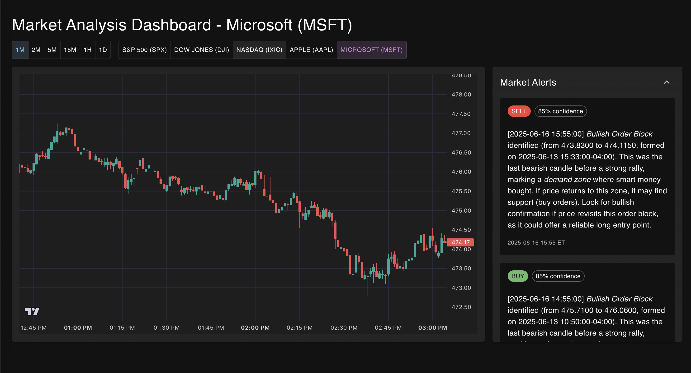

# 📊 Market Analysis

<div align="center">


*A powerful market analysis tool built with Python and FastAPI*

</div>



## 🌟 Features

- 📈 Real-time market data analysis using yfinance
- 📊 Interactive data visualization
- 🔄 Automated market calendar integration
- 🚀 FastAPI backend for high-performance data serving
- 📱 Modern frontend interface
- 📝 Jupyter notebook integration for analysis

## 🛠️ Tech Stack

- **Backend**: Python 3.12, FastAPI
- **Data Processing**: Pandas, NumPy
- **Market Data**: yfinance
- **Market Calendar**: pandas-market-calendars
- **Frontend**: Modern web technologies

## 🚀 Getting Started

### Prerequisites

- Python 3.12 or higher
- pip or uv package manager

### Installation

1. Clone the repository:
```bash
git clone https://github.com/yourusername/market-analysis.git
cd market-analysis
```

2. Create and activate a virtual environment:
```bash
python -m venv .venv
source .venv/bin/activate  # On Windows: .venv\Scripts\activate
```

3. Install dependencies:
```bash
pip install -e .
```

### Running the Application

1. Start the backend server:
```bash
uvicorn main:app --reload
```

2. Access the API documentation at `http://localhost:8000/docs`

## 📁 Project Structure

```
market_analysis/
├── backend/         # Backend API implementation
├── frontend/        # Frontend application
├── data/           # Data storage and processing
├── notebooks/      # Jupyter notebooks for analysis
├── src/            # Source code
└── market/         # Market-specific modules
```

## 📊 Data Analysis

The project includes various analysis tools:

- Market trend analysis
- Historical data processing
- Real-time market data fetching
- Custom indicator calculations

## 🤝 Contributing

Contributions are welcome! Please feel free to submit a Pull Request.

1. Fork the repository
2. Create your feature branch (`git checkout -b feature/AmazingFeature`)
3. Commit your changes (`git commit -m 'Add some AmazingFeature'`)
4. Push to the branch (`git push origin feature/AmazingFeature`)
5. Open a Pull Request

## 📝 License

This project is licensed under the MIT License - see the LICENSE file for details.

## 📫 Contact

<div align="center">
  <div style="margin-bottom: 10px; font-size: 1.2em; font-weight: bold; color: #fff;">Nima Kondori</div>
  <a href="https://www.linkedin.com/in/nima-kondori" target="_blank" style="margin-right: 20px; text-decoration: none;">
    
    <span style="font-size: 1.1em; vertical-align: middle; margin-left: 8px; color: #0A66C2;">LinkedIn</span>
  </a>
  <a href="mailto:nimakondori96@gmail.com" style="text-decoration: none;">
    
    <span style="font-size: 1.1em; vertical-align: middle; margin-left: 8px; color: #EA4335;">Email</span>
  </a>
</div>

---

<div align="center">
Made with ❤️ by Nima Kondori and Cursor AI :D 
</div>
